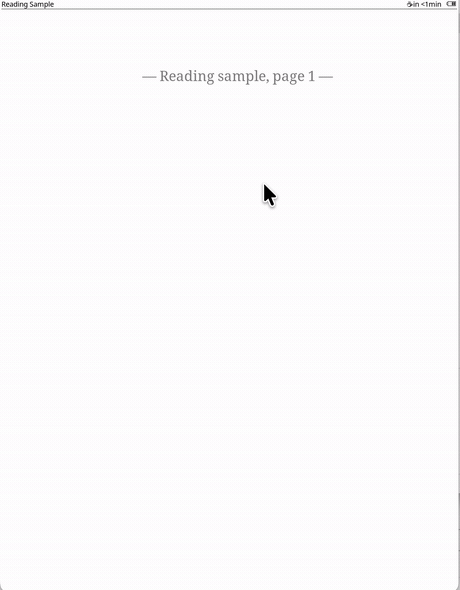
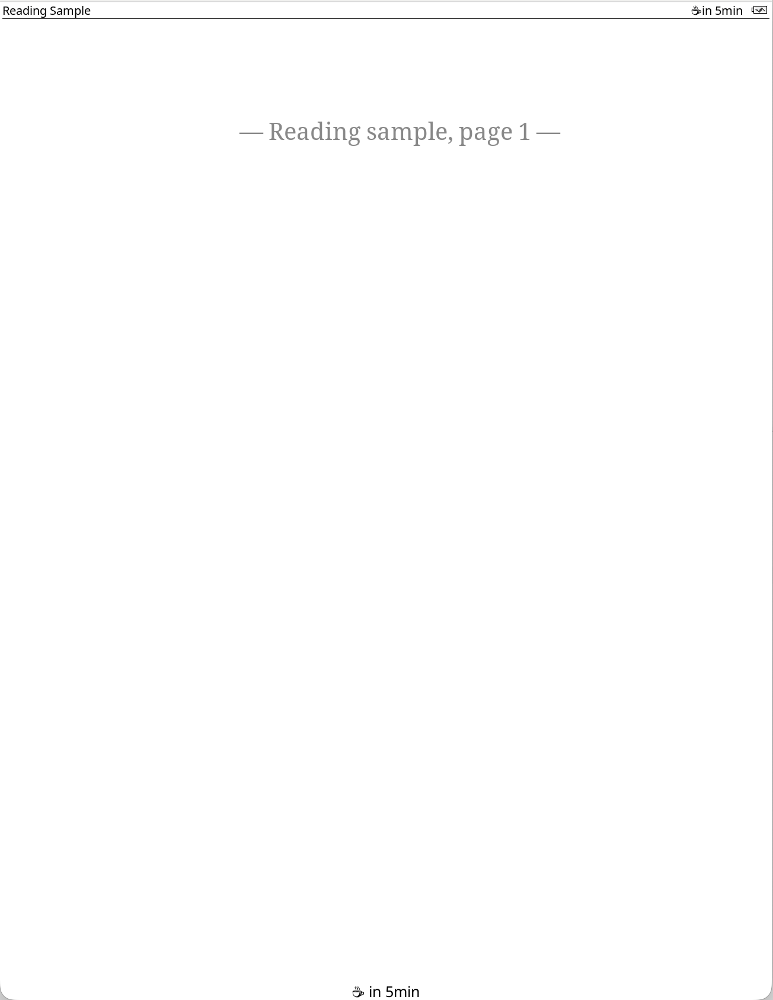
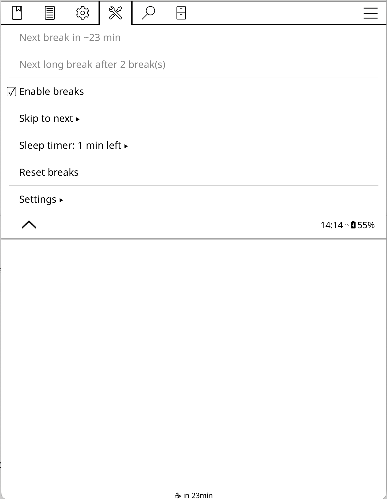
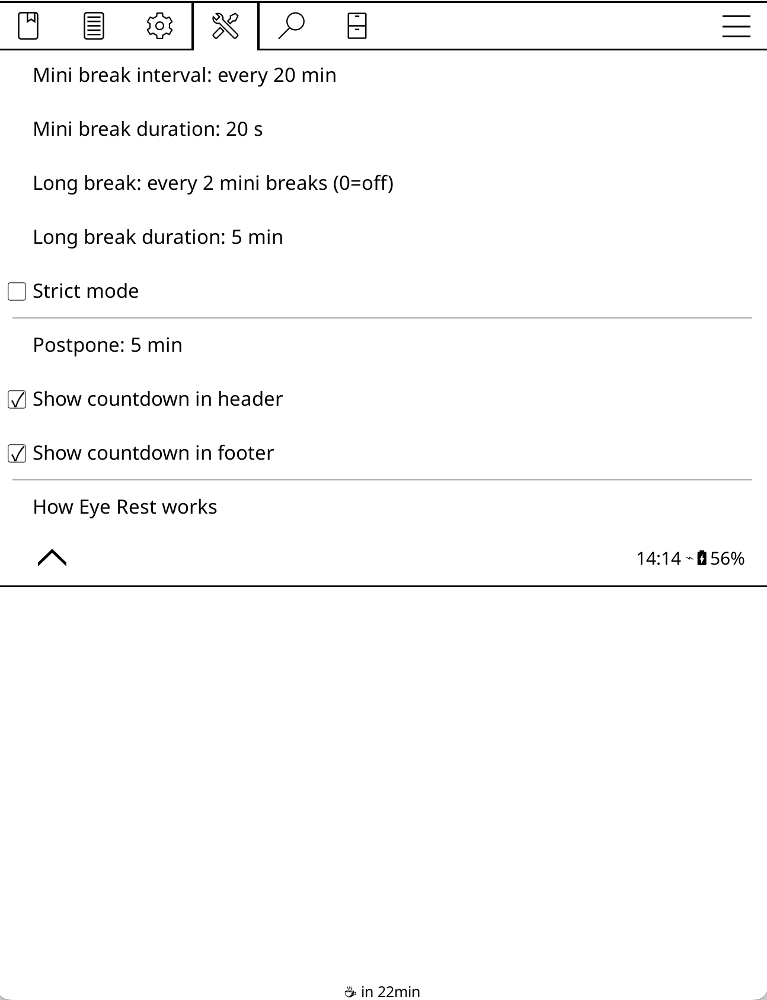
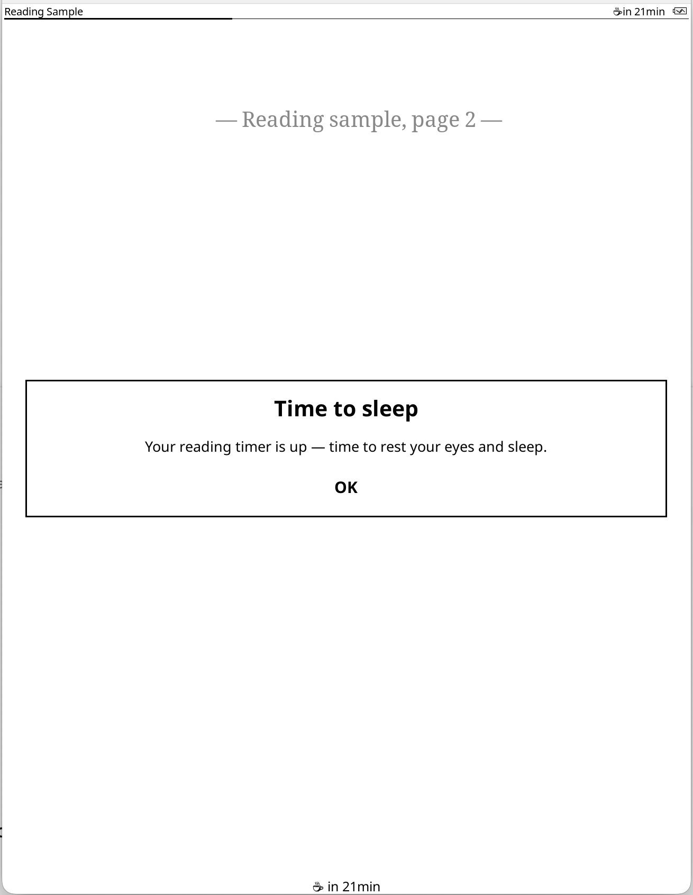
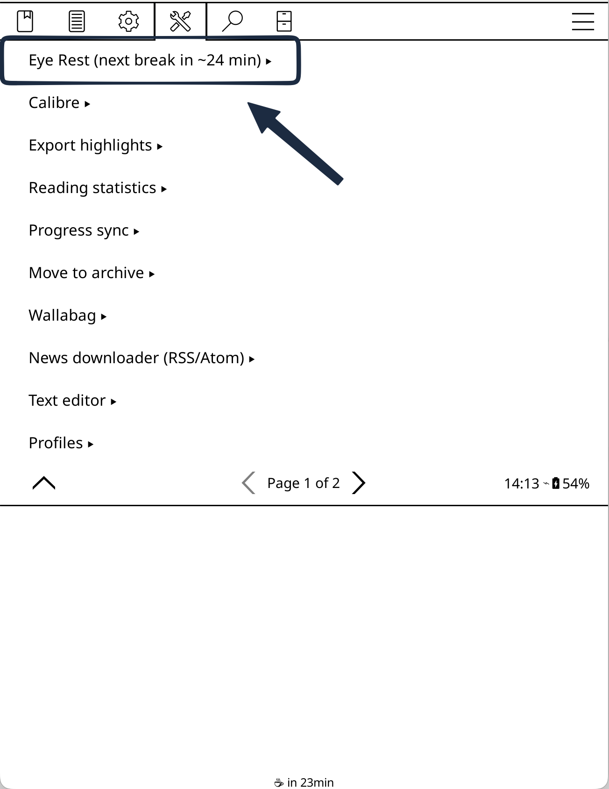

English | [简体中文](README.zh-CN.md)

# Eye Rest — eye-strain break reminder for KOReader

Eye Rest reminds you to look up and rest your eyes while reading on
[KOReader](https://github.com/koreader/koreader), so long sessions on a Kindle, Kobo, or other e-ink
reader don't leave your eyes aching. It's a [Stretchly](https://hovancik.net/stretchly/)-style break
reminder built around the **20-20-20 rule**: short *mini breaks* and periodic *long breaks*, paced by
how long you actually read. It also adds a one-shot **sleep timer** for bedtime reading. A
pomodoro-style, enhanced alternative to KOReader's built-in *Read timer*.

## Demo

When a break is due, a full-screen countdown takes over the page — skip it, postpone it, or (in
strict mode) just rest your eyes until it ends:

<p align="center">
  
</p>

The rest of the plugin stays out of the way until then:

|  |  |
| :--: | :--: |
| <br>**Status bar** — `☕ in N min` to the next break, shown in the header and footer | <br>**Menu** — enable, skip ahead, set a sleep timer, or reset; the title shows the next break inline |
| <br>**Settings** — intervals and durations to the second, long-break cadence, strict mode, postpone | <br>**Sleep timer** — a one-shot bedtime reminder that ends the reading session |

## The difference

Compared with the built-in *Read timer*:

| | Read timer | Eye Rest |
|---|---|---|
| Setup | Alarm and/or interval, plus auto-start / stop | One *Enable breaks* switch |
| Timing | Wall-clock, including idle time | Counts only while a book is open; pauses on book close and sleep |
| Break UI | A dismissable message popup | A full-screen countdown that ignores stray taps |
| Controls | — | Skip, postpone, or enforce with Strict mode |
| Break tiers | Basic | Mini breaks + periodic long breaks |
| Sleep timer | A wall-clock alarm | One-shot countdown → full-screen "time to sleep" reminder |
| E-ink refreshes per break | One per second | ~5 (segmented countdown) |

## Install

Eye Rest is a single `eyerest.koplugin` folder placed in KOReader's `plugins/` directory.

**Download a release (recommended):** grab `eyerest.koplugin.zip` from the
[latest release](https://github.com/CalebLinGit/eyerest.koplugin/releases/latest), unzip it, and move
the `eyerest.koplugin` folder into KOReader's `plugins/` directory so the path is
`…/koreader/plugins/eyerest.koplugin/`. The zip contains only the files the plugin needs.

**On a Kindle / remote device** (enable KOReader's *Tools → SSH server* first):

```sh
scp -P <port> -i <your_key> -r eyerest.koplugin \
  root@<device-ip>:/mnt/us/koreader/plugins/
```

> Cloning the repo works too, but it also pulls in development files (`tests/`, `assets/`) that the
> plugin doesn't need. Run `./package.sh` to produce the clean `eyerest.koplugin.zip` yourself.

**Then disable the built-in Read timer** — the two share a menu slot, so run one at a time:

1. **Tools → Plugin management** → untick **Read timer**.
2. Restart KOReader.

Eye Rest appears under **Tools → Eye Rest**. No KOReader files need editing.

## Usage

Everything lives under **Tools → Eye Rest** (the entry shows the next break inline):

<p align="center">
  
</p>

- **Enable breaks** — the main switch.
- **Skip to next** — go to a mini break or long break now.
- **Sleep timer** — a one-shot countdown (e.g. one hour); when it runs out a full-screen reminder tells you to stop reading. Independent of the eye breaks.
- **Reset breaks** — restart the cycle.
- **Settings:**

| Setting | Description |
|---------|-------------|
| Mini break interval | Reading time between mini breaks |
| Mini break duration | Length of a mini break (minutes : seconds) |
| Long break: every N mini breaks | Mini breaks before a long break (0 = off) |
| Long break duration | Length of a long break (minutes : seconds) |
| Strict mode | Hide Skip / Read-more; the break must run out |
| Postpone | How long *Read a bit more* defers a break |
| Show countdown in header / footer | Show time-to-next-break in the status bar |

## License

Inspired by [Stretchly](https://hovancik.net/stretchly/); built on
[KOReader](https://github.com/koreader/koreader). Licensed under the GNU Affero General Public
License v3.0 — see [LICENSE](LICENSE). Copyright © 2026 Caleb Lin.
